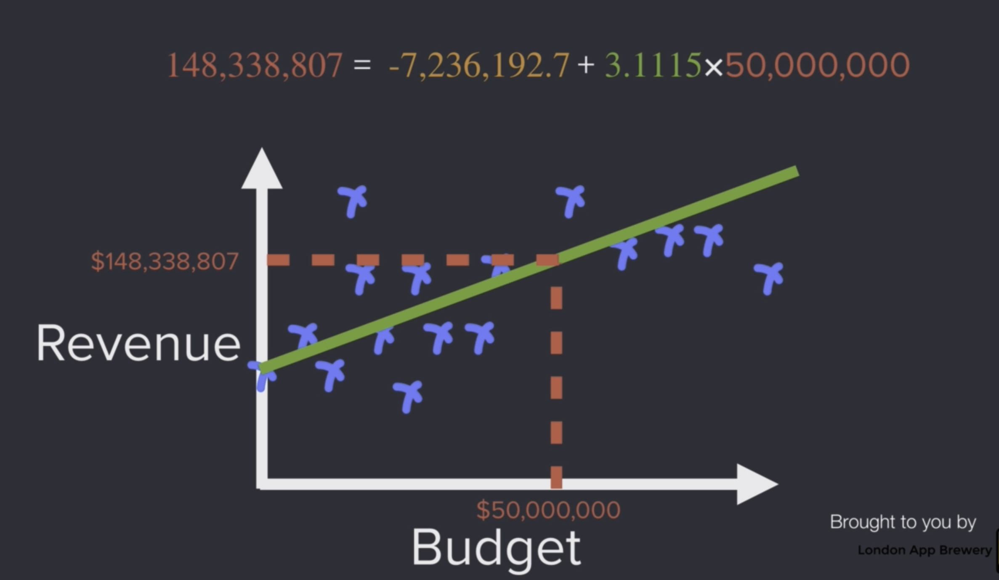
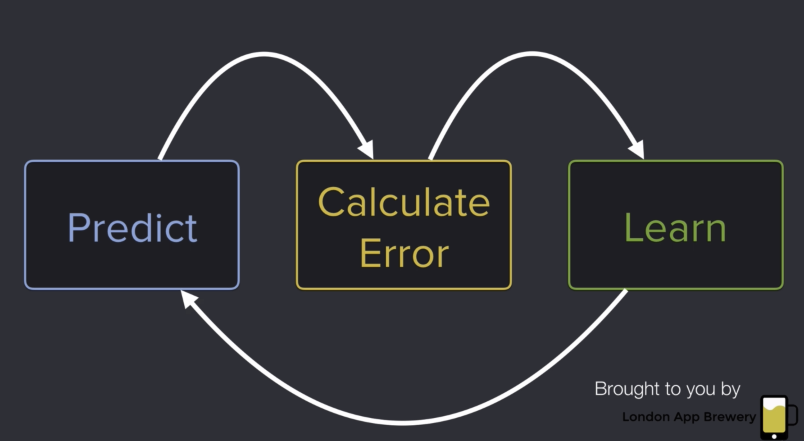

# My notes

## Data science life cycle: 

formulate question
gather question 
clean Data: missing, incomplete, inaccurate, formatting, etc 
explore and visualize
train algorithm
evaluate 
_____________________________
## Linear Regression: Why slope?
Is a statistical method to find a relationship between one dependent and one or more independent variables

The strong the relationship the stronger the slope
The weak the relationship the flat the slope

The relationship between dependent and independent must be linear. With the help of scatterplot it can be detected.
_____________________________
## Residuals
The gap between the actual and the predicted value.
Looks at the size and choose the ones that have the less residuals.
_____________________________
## Coefficients and intercepts
Rational: [examples](https://www.austincc.edu/mparker/1342/lessons/less5-8/interpret_slope.pdf)
_____________________________
## detect outliers
with histogram and boxplot
_____________________________
## homoscedasticity
the situation in which the variance of the dependent variable is same for all the data
_____________________________
## intercept and coefficient 
[source](https://support.minitab.com/en-us/minitab-express/1/help-and-how-to/modeling-statistics/regression/supporting-topics/regression-models/slope-and-intercept-of-the-regression-line/)

regression.intercept_ = if it is a positive number, this much will increase if a one point increases in 'x' variable
regression.coefficient_ = if it is a negative value, this much will decrease if the 'x' variable is 0.

_____________________________
## R2 (rsquare)
this measures the relationship between the model and the dependent variable on a scale of 0-100%.
_____________________________
## algorithm
this is a ML process does. 

_____________________________
## RSS (residual sum of squares)
The lower the number the better the line and the estimates for this coefficients. 
_____________________________
## Gradient Descent
This algorithm is used in order to draw a regression line(predicted values) using the minimum error( slope and intercept). An iterative model
is built until the rate of error is the least. (This topic needs to revisited often)
[source](https://medium.com/code-heroku/gradient-descent-for-machine-learning-3d871fa48b4c)
_____________________________
## How to convert categorical data to numerical?
Integer(label) encoding and One hot encoding
Label encoding is done on the discrete values, converted to numbers
In One hot encoding, a variable is removed and added as a new binary variable for each variable that is removed
_____________________________
## Sampling types
1. SRS - simple random sampling
2. Systematic Sampling - leaves bias
3. stratified sampling = Group same types of data, example colour, then apply SRS on each group
4. reservoir sampling = [link](https://www.youtube.com/watch?v=A1iwzSew5QY) a sample from stream on n items, where the length of n is unknown
5. resampling method = for imbalanced datasets. having The majority (negative) class and the minority (positive) class
_____________________________
## test and validation datasets
The concept of Training/Cross-Validation/Test Data Sets is as simple as this. When you have a large data set, it's recommended to split it into 3 parts:

### Training set (60% of the original data set): 
This is used to build up our prediction algorithm. Our algorithm tries to tune itself to the quirks of the training data sets. In this phase we usually create multiple algorithms in order to compare their performances during the Cross-Validation Phase.
### Cross-Validation set (20% of the original data set): 
This data set is used to compare the performances of the prediction algorithms that were created based on the training set. We choose the algorithm that has the best performance.
### Test set (20% of the original data set): 
Now we have chosen our preferred prediction algorithm but we don't know yet how it's going to perform on completely unseen real-world data. So, we apply our chosen prediction algorithm on our test set in order to see how it's going to perform so we can have an idea about our algorithm's performance on unseen data.

### Notes
1. It's very important to keep in mind that skipping the test phase is not recommended, because the algorithm that performed well during the cross-validation phase doesn't really mean that it's truly the best one, because the algorithms are compared based on the cross-validation set and its quirks and noises...
2. During the Test Phase, the purpose is to see how our final model is going to deal in the wild, so in case its performance is very poor we should repeat the whole process starting from the Training Phase.
_____________________________
## Machine Learning Loop
1. train a model
2. assess performance on validation set → if satisfactory, go to step 5
3. change model
4. go to step 1
5. assess performance on test set
6. Present model with test accuracy found in step 5
_____________________________
## Gradient Boosting 
Gradient boosting machines build sequential decision trees. Each tree will be built based on the previous tree’s error. Finally, predictions will be made by the sum of all of those trees.
_____________________________
## all about LightGBM vs XGBoost
[link](https://sefiks.com/2018/10/13/a-gentle-introduction-to-lightgbm-for-applied-machine-learning/)
_____________________________
## 

